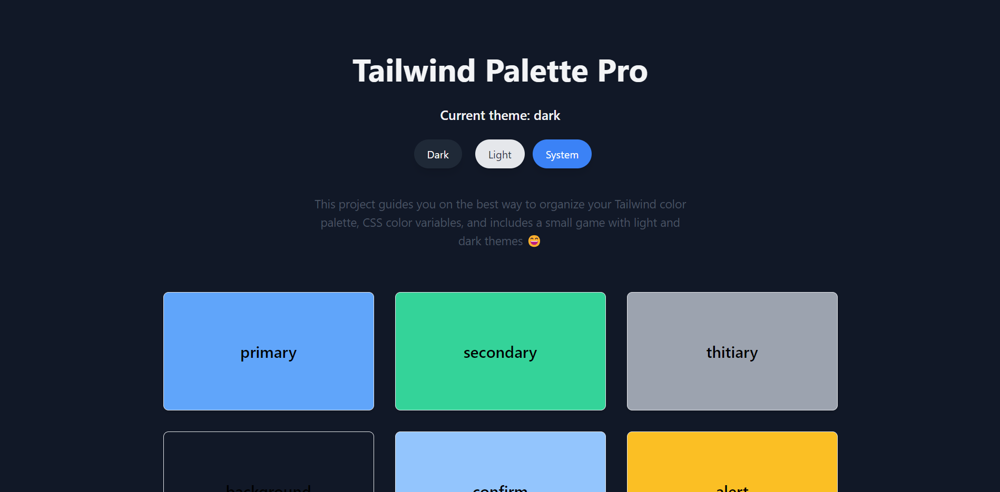

# 🌈 TailwindPalettePro

**TailwindPalettePro** is a comprehensive guide that combines CSS variables with Tailwind CSS, enabling developers to create stunning UIs with precise control over colors in both light and dark modes. It offers clear examples and best practices, making it simple to manage and customize color schemes for your next project.

---
## 
---
## 📚 Table of Contents

- [✨ Features](#-features)
- [💡 Concept](#-concept)
- [🛠️ How to Use](#-how-to-use)
  - [1. Define Your Colors](#1-define-your-colors)
  - [2. Extend Tailwind Config](#2-extend-tailwind-config)
  - [3. Apply Colors in HTML/JSX](#3-apply-colors-in-htmljsx)
  - [4. Switch Themes](#4-switch-themes)
- [🤝 Contribution](#-contribution)
- [📜 License](#-license)

---

## ✨ Features
- **CSS Variables Integration**: Seamlessly integrate CSS variables for color management.
  - background 
  - primary 
  - secondary 
  - warning **... etc**.
- **Light and Dark Themes**: Easy toggling between light and dark themes.
  - theme provider 
  - useTheme hooks  
- **Tailwind CSS Support**: Fully compatible with Tailwind CSS utility classes.
- **Customizable**: Easily modify color palettes to fit your project’s branding.

---

## 💡 Concept

TailwindPalettePro utilizes CSS variables to define colors in a consistent pattern: `{variable}-light` for light mode and `{variable}-dark` for dark mode. These variables are then applied globally using `:root` for the default light mode and `.dark` for dark mode overrides.

---

## 🛠️ How to Use

### 1. Define Your Colors
Start by defining your colors using CSS variables. Place these within the :root selector for the light theme and within the .dark class for the dark theme.

### Example CSS Setup
```css
@tailwind base;
@tailwind components;
@tailwind utilities;

@layer base {
  :root {
    /* Light theme colors */
    --primary-light: #1d4ed8; /* Blue */

    /* Dark theme colors */
    --primary-dark: #60a5fa; /* Light Blue */

    /* Default to light theme values */
    --primary: var(--primary-light);
  }

  /* Dark theme overrides */
  .dark {
    --primary: var(--primary-dark);
  }
}
```

> By using this setup, TailwindPalettePro allows you to easily switch between light and dark themes. The primary color automatically adapts to the active theme, while giving you manual control over the light and dark mode variants through primary-light and primary-dark.


---

### 2. Extend Tailwind Config
Next, extend the Tailwind CSS configuration file to incorporate these variables. This makes the colors available throughout your project as Tailwind utilities.

```javascript
  module.exports = {
  theme: {
    extend: {
      colors: {
        primary: {
          DEFAULT: "var(--primary)",
          light: "var(--primary-light)",
          dark: "var(--primary-dark)",
        },
        // Add more colors as needed
      },
    },
  },
};
```
> Now then it gives you three variable to apply color `primary`, `primary-light` and `primary-dark`.

--- 

### 3. Apply Colors in HTML/JSX

You can use theme-based colors in your HTML or JSX files with a single Tailwind class.

#### Theme-Based Color

The `bg-primary` class automatically switches between light and dark mode colors.

```jsx
const App = () => (
  <div className="bg-primary text-white p-4 rounded-lg">
    Welcome to light/dark mode!
  </div>
);
```

#### Light Mode Color Only

Use bg-primary-light to always display the light mode color.
```JSX
const App = () => (
  <div className="bg-primary-light text-black p-4 rounded-lg">
    Always show light mode color
  </div>
);
```

#### Dark Mode Color Only
Use bg-primary-dark to always display the dark mode color.
```JSX
const App = () => (
  <div className="bg-primary-dark text-white p-4 rounded-lg">
    Always show dark mode color
  </div>
);
```

---

### 4. Switch Themes

Easily switch between light, dark, and system themes using the `useTheme` hook. Be sure to wrap your app with the `ThemeProvider`.

#### Step 1: Set Up the Theme Provider

Wrap your application with the `ThemeProvider` to ensure theme context is available throughout your app.

```jsx
import { StrictMode } from "react";
import { createRoot } from "react-dom/client";
import App from "./App";
import "./index.css";
import { ThemeProvider } from "./HOC/theme-provider";

createRoot(document.getElementById("root")!).render(
  <StrictMode>
    <ThemeProvider>
      <App />
    </ThemeProvider>
  </StrictMode>
);
```

#### Step 2: Implement Theme Switching
Use the `useTheme` hook to enable theme switching within your app.
```JSX
import React from 'react';
import { useTheme } from "@Hooks/useTheme";

const App = () => {
  const { setTheme, theme } = useTheme();

  return (
    <div className="flex flex-col items-center justify-center min-h-screen">
      <h1 className="text-2xl mb-4">Current Theme: {theme}</h1>
      <div className="space-x-3">
        <button
          className="px-5 py-2.5 bg-gray-800 text-white rounded-full hover:bg-gray-700 transition duration-300 shadow-lg"
          onClick={() => setTheme("dark")}
        >
          Dark
        </button>
        <button
          className="px-5 py-2.5 bg-gray-200 text-gray-800 rounded-full hover:bg-gray-300 transition duration-300 shadow-lg"
          onClick={() => setTheme("light")}
        >
          Light
        </button>
        <button
          className="px-5 py-2.5 bg-blue-500 text-white rounded-full hover:bg-blue-400 transition duration-300 shadow-lg"
          onClick={() => setTheme("system")}
        >
          System
        </button>
      </div>
    </div>
  );
};

export default App;
```

### Explanation

- **ThemeProvider**: Wraps your app to provide theme context.
- **useTheme Hook**: Handles theme state and allows switching between themes.
- **Buttons**: Trigger theme changes with a smooth transition and provide feedback on the current theme.

This setup lets users easily toggle between light, dark, and system modes, enhancing the overall user experience.


---

### 🤝 Contribution
We welcome contributions to improve this guide! Feel free to submit a pull request or open an issue with suggestions or improvements.

---

### 📜 License
This project is licensed under the MIT License - see the [LICENSE](LICENSE) file for details.
